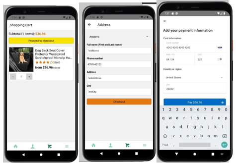

IFT 598 – Data in Cloud Project (Arizona State University) 

Our project is a dog-related smartphone application. Using ratings and reviews, we only show products that have received high ratings from users. React Native, Android Studio, and Typescript are the front-end technologies used.
Because we're utilizing React Native, we're creating a single-page application with a faster response time and infinite scrolling for the main menu products.
AWS amplify, graphql, aws app sync, and aws dynamo db are the backend technologies. Stripe has also been incorporated into our application to handle payments.

 

After successfull payment with stripe

